<div align="center">


# GovGate

## 🏛️ A unified civic engagement platform connecting citizens, government, and advertisers

### Special thanks to My colleages : 
 [Mazen Yasser](https://github.com/mazona200) & Salma Walid for setting Up this project foundations , setting up firebase authentication , firestore , implementing Government role backend and testing .

[Mohamed Tamer](https://github.com/MooTamer) for implementing the Advertiser role backend and testing .


<br/>

[](https://flutter.dev)
[](https://dart.dev)
[](https://firebase.google.com)
[](https://m3.material.io)
[](#)
[](#-license)

</div>

---

## 📖 About

**GovGate** is a mobile-first civic engagement platform that brings together three audiences under one roof — **citizens**, **government administrators**, and **local advertisers**. It is designed to make civic participation effortless: report a pothole on your street, vote on a city poll, hear back from your local council, or promote a community business — all from a single app.

> 🎓 **Built as a university project for Software Mobile Course , GovGate showcases a production-grade Flutter architecture, role-based access control, and a Firebase-powered realtime backend.**

---

## ✨ Highlights

<table>
  <tr>
    <td align="center" width="33%">
      <h3>🔐</h3>
      <strong>Role-based Access</strong>
      <br/><sub>Three tightly scoped user experiences enforced both client-side and via Firestore rules.</sub>
    </td>
    <td align="center" width="33%">
      <h3>📡</h3>
      <strong>Realtime Backend</strong>
      <br/><sub>Live updates across announcements, polls, messages, and ad approvals via Firestore streams.</sub>
    </td>
    <td align="center" width="33%">
      <h3>🗺️</h3>
      <strong>Location-aware</strong>
      <br/><sub>Geotagged problem reports with Google Maps picker and photo evidence.</sub>
    </td>
  </tr>
  <tr>
    <td align="center" width="33%">
      <h3>🔔</h3>
      <strong>Push Notifications</strong>
      <br/><sub>FCM-powered alerts for replies, announcements, and ad status changes.</sub>
    </td>
    <td align="center" width="33%">
      <h3>🎨</h3>
      <strong>Role-themed UI</strong>
      <br/><sub>Each role has a distinct color palette — green, blue, orange — for instant context.</sub>
    </td>
    <td align="center" width="33%">
      <h3>🛡️</h3>
      <strong>Secure Storage</strong>
      <br/><sub>Credentials and session state in OS-level secure storage; App Check enabled.</sub>
    </td>
  </tr>
</table>

---

## 🎭 Three Roles, One App

<div align="center">

| 👤 Citizen <br/> <sub>🟢 green</sub> | 🏛️ Government <br/> <sub>🔵 blue</sub> | 📣 Advertiser <br/> <sub>🟠 orange</sub> |
|:---|:---|:---|
| Read public announcements | Publish announcements | Submit advertisements |
| Vote in active polls | Create & close polls | Track approval status |
| Send messages to government | Inbox & reply to citizens | Manage active campaigns |
| Report local problems (📷 + 📍) | Triage problem reports | View campaign analytics *(soon)* |
| Browse approved local ads | Approve / reject ads | Account settings *(soon)* |
| Quick-dial emergency numbers | Maintain emergency contacts | |
| Live notifications | Community dashboard | |

</div>

---

### 🚪 Onboarding & Auth

<div align="center">

| Role Selection | Login | Signup |
|:---:|:---:|:---:|
| 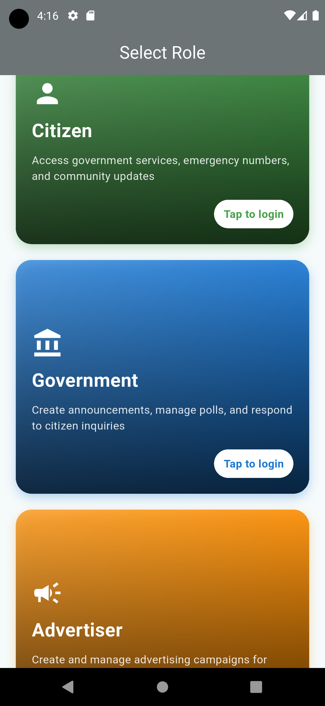 | 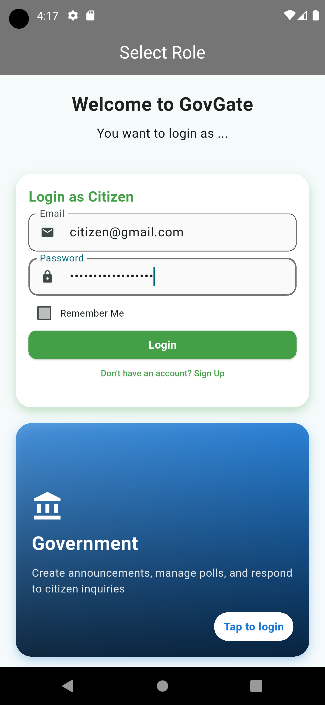 | 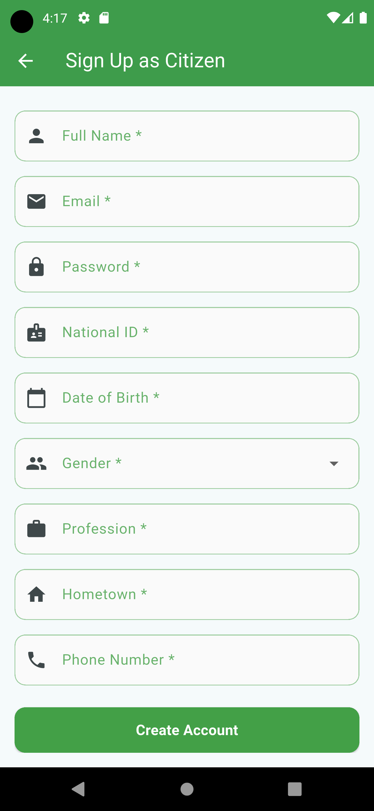 |

</div>

### 👤 Citizen Experience

<div align="center">

| Home | Announcements | Report a Problem |
|:---:|:---:|:---:|
| 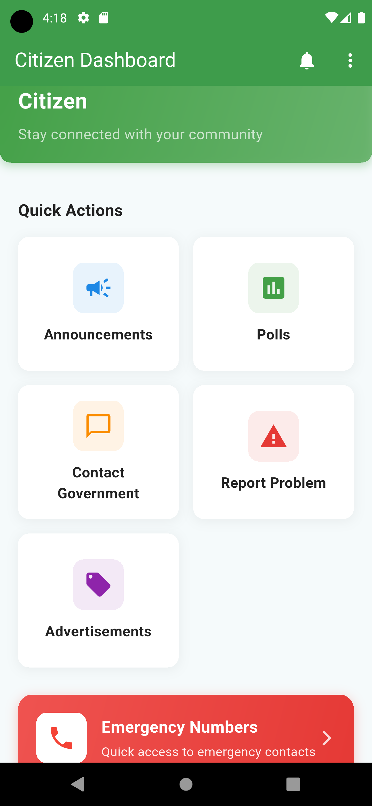 | 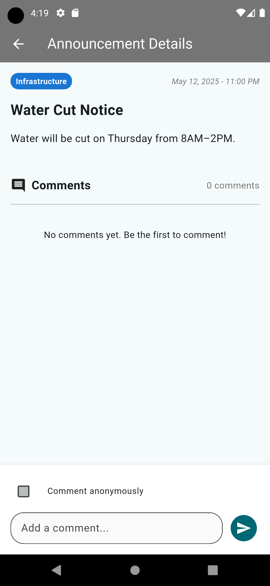 | 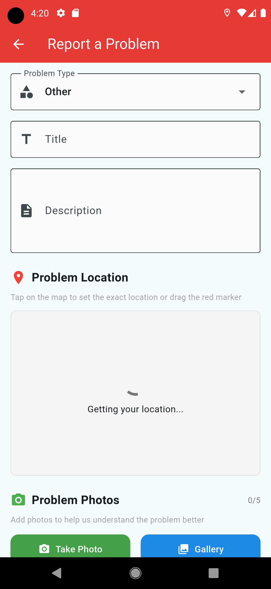 |

| Polls | Contact Government | Emergency Numbers |
|:---:|:---:|:---:|
| 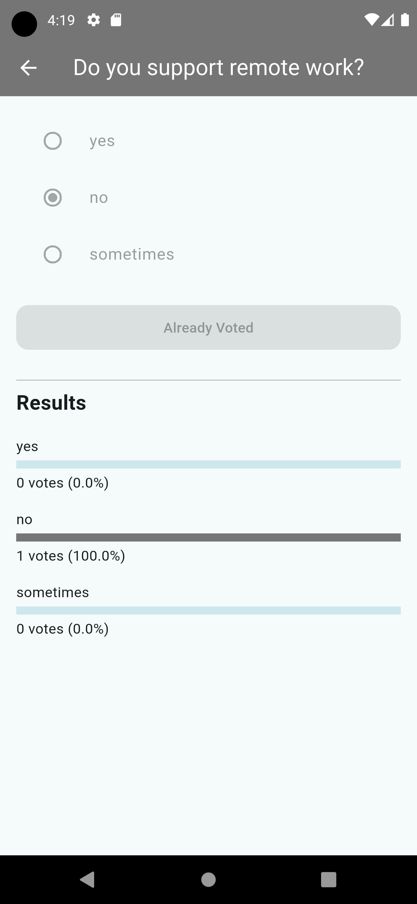 | 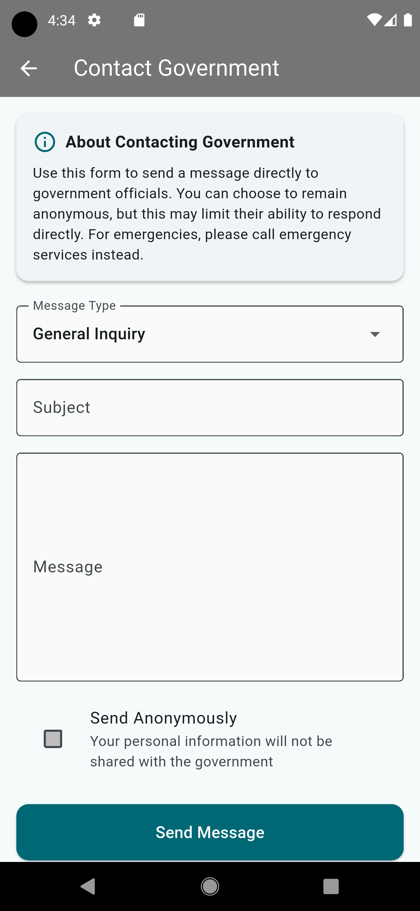 | 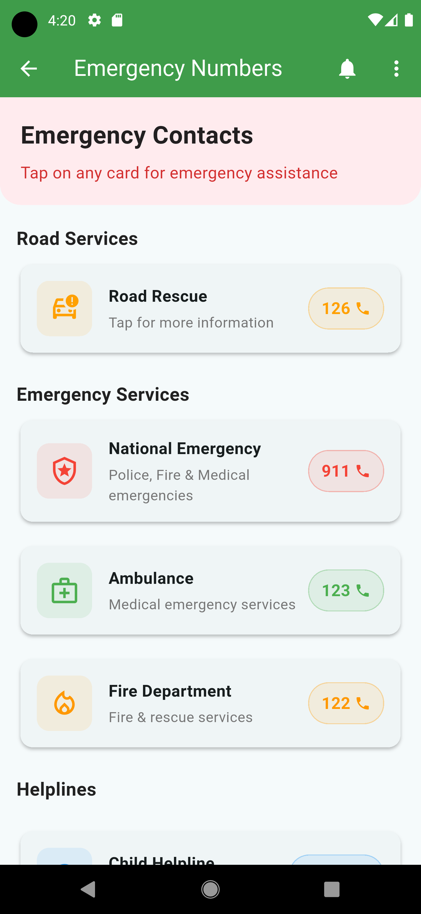 |

</div>

### 🏛️ Government Experience

<div align="center">

| Dashboard | Inbox | Review Ads |
|:---:|:---:|:---:|
| 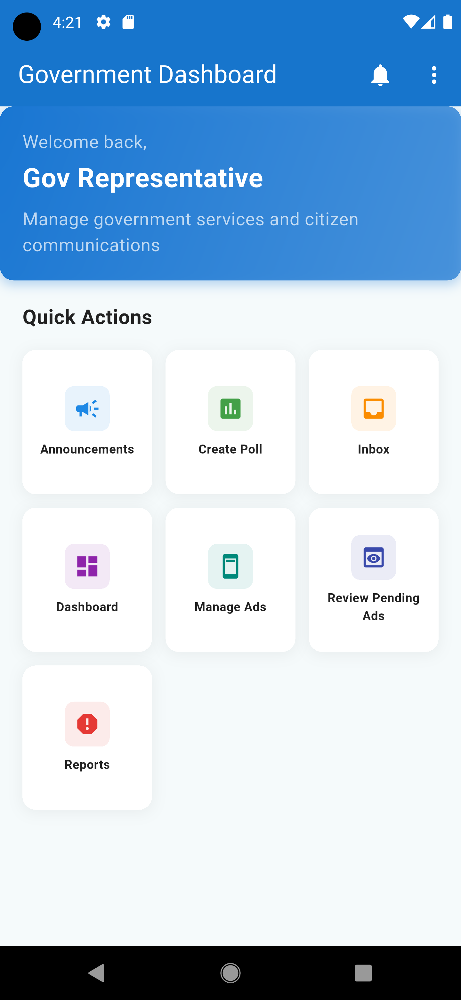 | 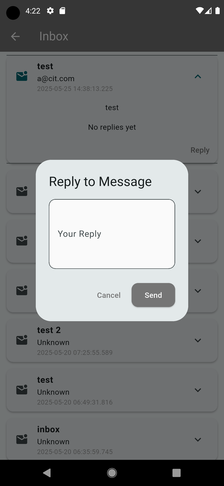 | 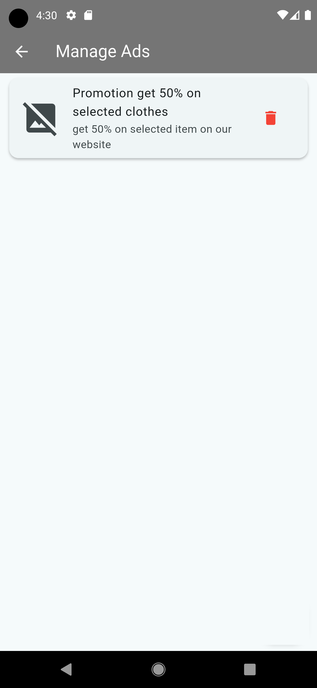 |

</div>

### 📣 Advertiser Experience

<div align="center">

| Dashboard | Create Ad | Manage Ads |
|:---:|:---:|:---:|
| 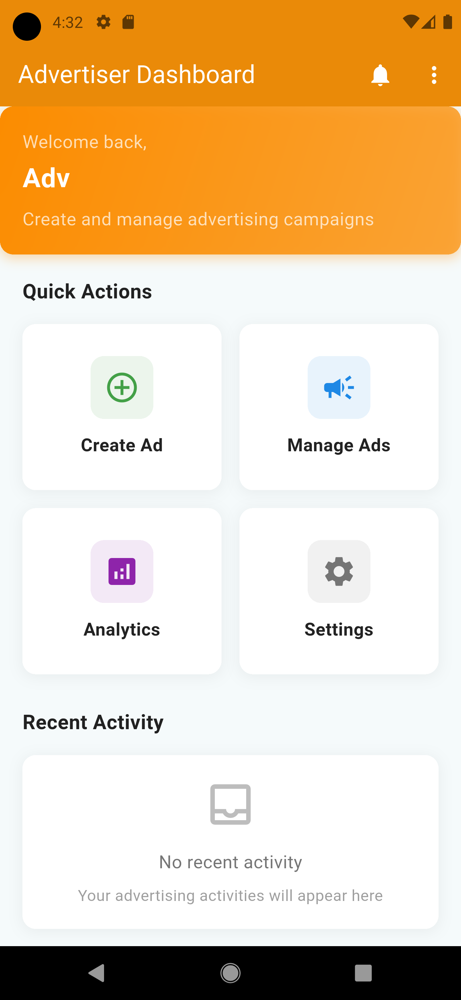 | 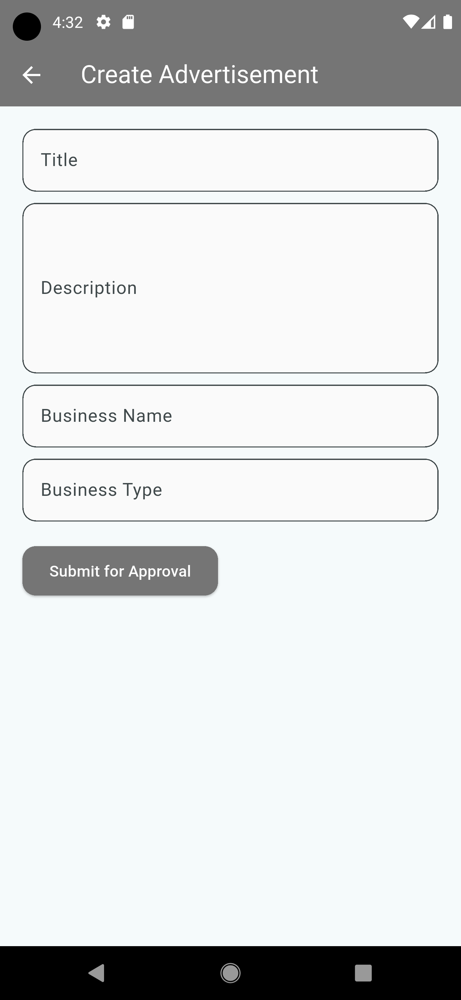 | 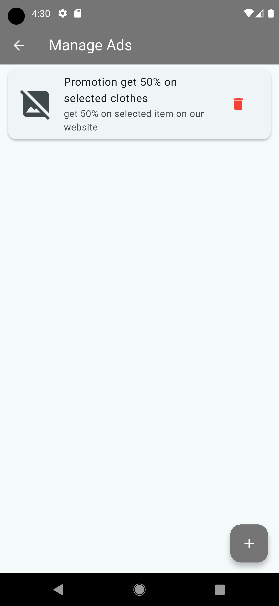 |

</div>

---

## 🛠️ Tech Stack

<div align="center">

**Frontend**


**Backend & Services**


**Platform APIs**


</div>

---

## 🧱 Architecture

```text
┌─────────────────────────────────────────────────────────────┐
│                         GovGate App                         │
│                                                             │
│  ┌──────────────┐   ┌──────────────┐   ┌──────────────┐     │
│  │   Citizen    │   │  Government  │   │  Advertiser  │     │
│  │    Pages     │   │    Pages     │   │    Pages     │     │
│  └──────┬───────┘   └──────┬───────┘   └──────┬───────┘     │
│         └──────────────────┼──────────────────┘             │
│                   RoleProtectedPage                         │
│                            │                                │
│  ┌──────────────────────────────────────────────────────┐   │
│  │                    Services Layer                    │   │
│  │  AuthService · DatabaseService ·AdvertisementService │   │
│  │  PushNotificationService · ThemeService· ErrorHandler│   │
│  └──────────────────────────┬───────────────────────────┘   │
└─────────────────────────────┼───────────────────────────────┘
                              │
       ┌──────────────────────┼──────────────────────┐
       ▼                      ▼                      ▼
┌────────────┐         ┌────────────┐         ┌────────────┐
│  Firebase  │         │  Firestore │         │  Firebase  │
│    Auth    │         │  + Rules   │         │  Storage   │
└────────────┘         └────────────┘         └────────────┘
                              │
                              ▼
                       ┌────────────┐
                       │    FCM     │
                       └────────────┘
```

**Why this shape?**
- **`RoleProtectedPage`** wraps every screen and enforces role checks against secure-cached credentials before render.
- **Services** are stateless static singletons — easy to mock for tests.
- **Firestore Security Rules** mirror the in-app role gates, so the data layer is safe even if a client misbehaves.

---

## 🚀 Getting Started

### Prerequisites

- Flutter `3.7.2` or newer ([install guide](https://docs.flutter.dev/get-started/install))
- Android Studio / Xcode for emulators
- A [Firebase project](https://console.firebase.google.com)

### Setup

```bash
# 1. Clone and install dependencies
git clone <your-repo-url>
cd mobileApp
flutter pub get

# 2. Configure Firebase (see below)
#    Drop google-services.json into android/app/
#    Drop GoogleService-Info.plist into ios/Runner/

# 3. Run on a connected device or emulator
flutter run
```

### Firebase configuration

| Step | What to do |
|---|---|
| 1️⃣ | Create a Firebase project at [console.firebase.google.com](https://console.firebase.google.com) |
| 2️⃣ | Add an Android app with package name `com.govgate.app` and download `google-services.json` |
| 3️⃣ | Enable **Authentication → Email/Password** |
| 4️⃣ | Create a **Firestore** database in test mode, then deploy the rules from [`firestore.rules`](firestore.rules) |
| 5️⃣ | Enable **Storage** (default rules are fine for development) |
| 6️⃣ | (Optional) Enable **Cloud Messaging** for push notifications |

---

## 🗂️ Project Structure

```
lib/
├── main.dart                     # App entrypoint, Firebase init
│
├── common/                       # Shared screens
│   ├── role_selection_page.dart  # The welcome screen with role cards
│   ├── login_page.dart
│   ├── signup_page.dart
│   ├── forgot_password_page.dart
│   ├── polls_page.dart
│   ├── poll_page.dart
│   └── poll_results_page.dart
│
├── citizen/                      # 👤 Citizen-only screens
│   ├── citizen_home_page.dart
│   ├── announcement_details_page.dart
│   ├── contact_government_page.dart
│   ├── emergency_numbers_page.dart
│   ├── problem_reporting_page.dart
│   ├── view_advertisements_page.dart
│   └── view_message_page.dart
│
├── government/                   # 🏛️ Government-only screens
│   ├── gov_home_page.dart
│   ├── gov_dashboard_page.dart
│   ├── gov_reports_page.dart
│   ├── announcements_list_page.dart
│   ├── create_announcement_page.dart
│   ├── edit_announcement_page.dart
│   ├── gov_announcements_page.dart
│   ├── create_poll_page.dart
│   ├── inbox_page.dart
│   ├── manage_ads_page.dart
│   └── review_advertisments_page.dart
│
├── advertiser/                   # 📣 Advertiser-only screens
│   ├── advertiser_home_page.dart
│   ├── create_advertisment_page.dart
│   └── manage_ads_page.dart
│
├── components/                   # Reusable widgets
│   ├── role_protected_page.dart  # Role gating wrapper
│   ├── shared_app_bar.dart
│   └── coming_soon_page.dart
│
├── models/                       # Data models
│   ├── advertisement.dart
│   └── poll_model.dart
│
├── services/                     # Business logic & Firebase wrappers
│   ├── auth_service.dart
│   ├── database_service.dart
│   ├── advertisement_service.dart
│   ├── push_notifications.dart
│   ├── theme_service.dart
│   ├── theme_provider.dart
│   └── error_handler.dart
│
└── utils/
    └── string_extensions.dart
```

---
---


## 📄 License

This project is built for academic purposes as part of a university coursework. Feel free to learn from the code; please don't ship it as your own.

<div align="center">

<br/>

<sub>Built with 💙 using Flutter & Firebase</sub>

</div>
